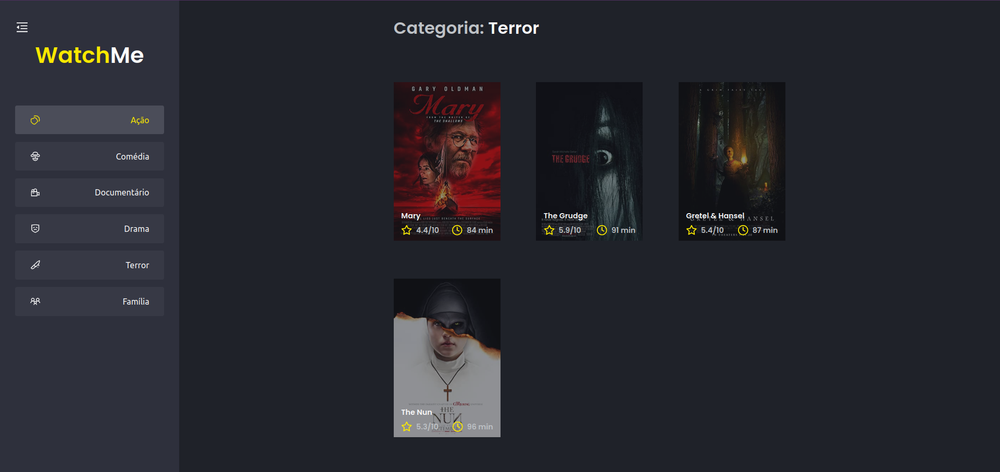
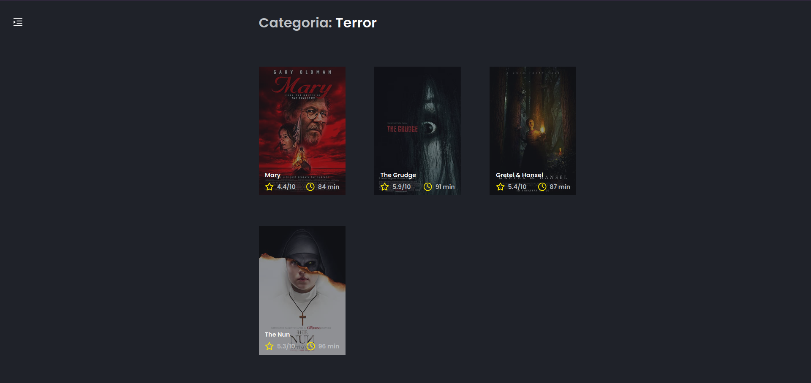
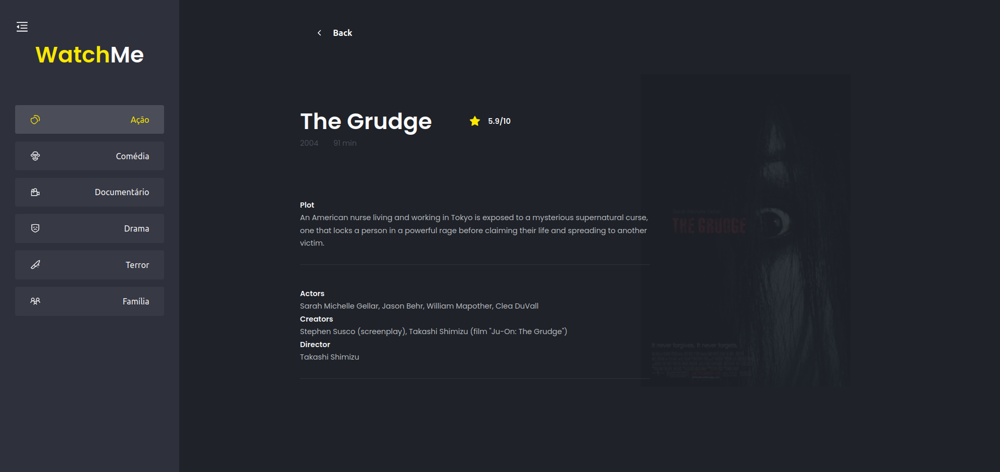

<div align="center">
    
</div>

<h3 align="center"> 
   Ignite ReactJS - Challenge 01: Componentizing an application
</h3>

---

# :rocket: Final Project

<div align="center">
    
   
   
</div>

# :pushpin: Table of Contents

- [Features](#rocket-Challenge-Features)
- [Api](#construction_worker-Fake-api-resources)
- [License](#closed_book-license)

# :rocket: Challenge Features

- [x] Film Listing.
- [x] In the sidebar it is possible to select which category of films should be listed.
- [x] The first category on the list (which is "Action") should start as marked.
- [x] The application header has only the name of the selected category that must change dynamically.

## Additional features (this features are not part of the challenge)

- [x] Sidebar can now be minimized and expanded.
- [x] Film card are now clickable and shows more details about the selected film.

## :construction_worker: Fake api resources

For this challenge, in addition to the concepts seen in class, we will use some new things to make our application even better. So, before going directly to the challenge code, we will explain a little bit about Fake API with JSON Server.

## Fake API with JSON Server

Just as we use MirageJS in module 2 to simulate an API with transaction data from the dt.money application, we will use JSON Server to simulate an API that has the information of genres and films.

Navigate to the created folder, open it in Visual Studio Code and execute the following commands in the terminal:

```bash
yarn
yarn server
```

Then you will see the message:


Note that he started a fake API with the `/genres` and` /movies` resources in `localhost` on port` 3333` from the information in the server.json file located at the root of your project. Accessing these routes in your browser, you can see the return of the information already in JSON:


That way, you just need to consume these API routes normally with Axios.

# :closed_book: License

Released in 2021
This project is under a license [MIT](./LICENSE).

<p align="right">(<a href="#top">back to top</a>)</p>

Challenge proposed with 💜 by Rocketseat 👋 [Join this community!](https://discord.gg/KJVerdEynf)

Made with 💜 by [Rafael Barros](https://github.com/Rafaelb4rros) 🚀
