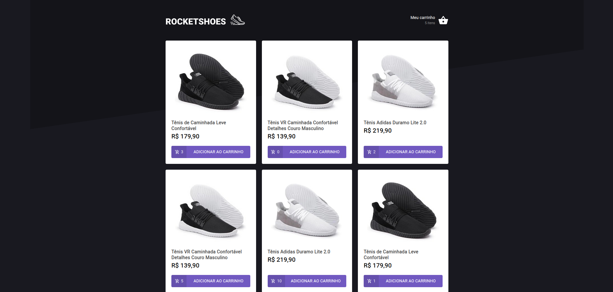
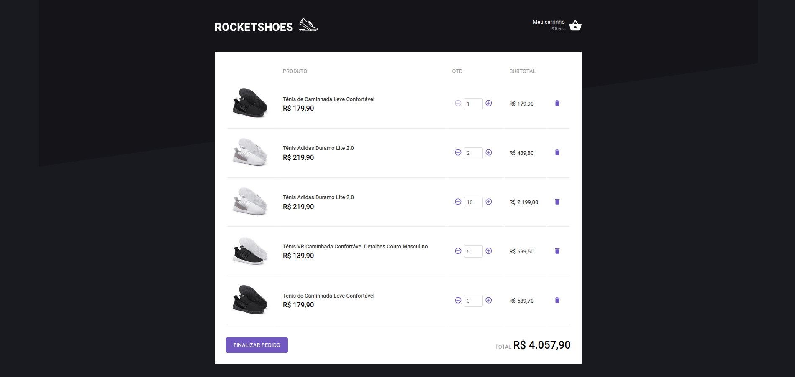

<div align="center">
    
</div>

<h3 align="center"> 
   Ignite ReactJS - Challenge 03: Creating a shopping cart hook
</h3>

# :rocket: Final Project

<div align="center">
    
   
</div>

# :pushpin: Table of Contents

- [Features](#rocket-Challenge-Features)
- [Api](#construction_worker-Fake-api-resources)
- [License](#closed_book-license)

# :rocket: Challenge Features

- [x] Add a new product to the cart
- [x] Store cart data in localStorare 
- [x] Remove a product from the cart
- [x] Change the quantity of a product in the cart
- [x] Calculation of the sub-total and total cart prices
- [x] Inventory validation
    - [x] User can not increment product amount if the current amount are bigger than stock amount
- [x] Display of error messages with react toastfy

## :construction_worker: Fake api resources

For this challenge, in addition to the concepts seen in class, we will use some new things to make our application even better. So, before going directly to the challenge code, we’ll explain a little bit of:

- Fake API with JSON Server;

### Fake API with JSON Server

Just as we use MirageJS in module 2 to simulate an API with transaction data from the dt.money application, we will use JSON Server to simulate an API that has the information of genres and films.

Navigate to the created folder, open it in Visual Studio Code and execute the following commands in the terminal:

```bash
yarn
yarn server
```

Then you will see the message:


Notice that he started a fake API with the resources `/stock` and `/products` on `localhost` on port `3333` from the information in the server.json file located at the root of your project. Accessing these routes in your browser, you can see the return of the information already in JSON:


That way, you just need to consume these API routes normally with Axios.

<!-- LICENSE -->

# :closed_book: License

Released in 2021
This project is under a license [MIT](./LICENSE).

<p align="right">(<a href="#top">back to top</a>)</p>

Challenge proposed with 💜 by Rocketseat 👋 [Join this community!](https://discord.gg/KJVerdEynf)

Made with 💜 by [Rafael Barros](https://github.com/Rafaelb4rros) 🚀
