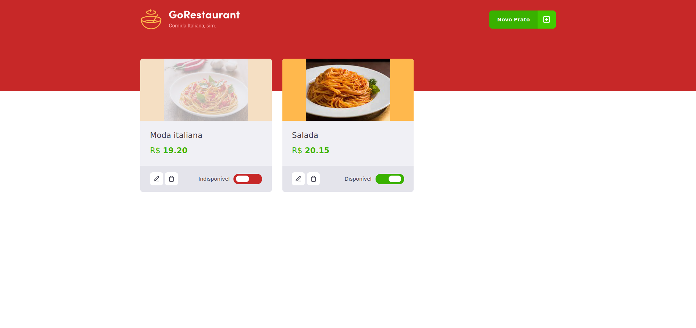
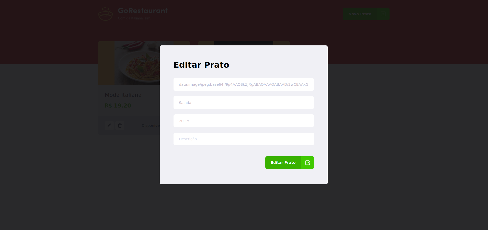

<div align="center">
    
</div>

<h3 align="center"> 
   Ignite ReactJS - Challenge 03: Creating a shopping cart hook
</h3>

# :rocket: Final Project

<div align="center">
    
   
</div>

## :rocket: About the challenge

This will be an already functional application where its main objective is to perform two migration processes: from Javascript to Typescript and from Class Components to Function Components.

## :construction_worker: Preparing for the challenge

For this challenge, in addition to the concepts seen in class, we will use the JSON server to create a Fake API with food data.

### Fake API with JSON Server

Just as we use MirageJS in module 2 to simulate an API with transaction data from the dt.money application, we will use JSON Server to simulate an API that has food information.

Navigate to the created folder, open it in Visual Studio Code and execute the following commands in the terminal:

```bash
yarn
yarn server
```

Then you will see the message:


Note that he started a fake API with the `/foods` feature in `localhost` on port `3333` from the information in the server.json file located at the root of your project. Accessing this route in your browser, you can see the return of the information already in JSON:


# :wrench: What should I edit in the application?

With the template already cloned, the dependencies installed and the fake API running, you must edit the following files:

- src/components/Food/index.jsx;
- src/components/Food/styles.js;
- src/components/Header/index.jsx;
- src/components/Header/styles.js;
- src/components/Input/index.jsx;
- src/components/Input/styles.js;
- src/components/Modal/index.jsx;
- src/components/ModalAddFood/index.jsx;
- src/components/ModalAddFood/styles.js;
- src/components/ModalEditFood/index.jsx;
- src/components/ModalEditFood/styles.js;
- src/pages/Dashboard/index.jsx;
- src/pages/Dashboard/styles.js;
- src/routes/index.jsx;
- src/services/api.js;
- src/styles/global.js;
- src/App.js;
- src/index.js.

All of these files must be migrated from Javascript to Typescript. In addition, files that have components in class must be migrated to functional components.

<!-- LICENSE -->

# :closed_book: License

Released in 2021
This project is under a license [MIT](./LICENSE).

<p align="right">(<a href="#top">back to top</a>)</p>

Challenge proposed with 💜 by Rocketseat 👋 [Join this community!](https://discord.gg/KJVerdEynf)

Made with 💜 by [Rafael Barros](https://github.com/Rafaelb4rros) 🚀
